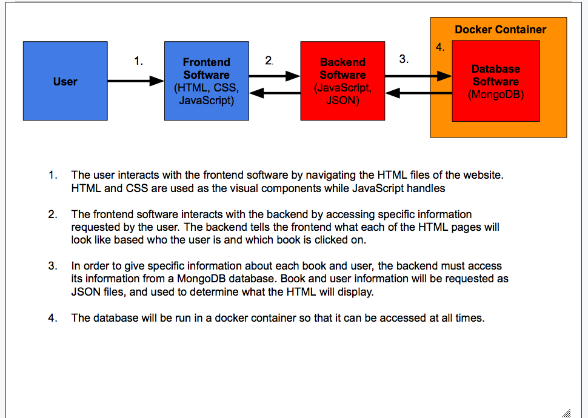

# Milestone 3
## Bookmark
#### Sarthak, Albert, Tyler, Lucas, and Andy

### Architecture Diagram

#### What features were completed?

##### Database Feature  

MongoDB is up and running in a docker container, and can successfully communicate with our Node.js server.
Books can be added to the database from a CSV file.

##### UI Features
1) Home Page

2) Sign in form

3) Registration form
 

#### What worked during the demo?

The database functioned during the demo as expected - we first emptied our database, and then repopulated it with a CSV file 
using our Node.js server.  

#### What issues were faced either during the development or during the demo?

Currently, we're having trouble passing data collected from our HTML forms to our Node.js server for database processing. 

#### What were the suggestions offered by the TA?

Karthik helped a lot with getting our DB connected to Node. He also suggested that we set up Mongo in docker,
which is our current implementation.   

#### Individual contributions by each team member

##### Andy: 

Set up MongoDB in Docker, went to office hours (with Lucas, Tyler, Sarthak, and Albert) to get the Node.js server up
and running. Wrote a CSV to JSON converter in shell script, and wrote a Node function to read our JSON objects into the DB. Recieved help and suggestions from Tyler and Lucas throughout.

##### Lucas:

Helped set up MongoDB database in docker (although Andy did most of the work) and began to integrate database with HTML files for webpage. In addition, created the architecture diagram.

##### Sarthak:

Set up and created the html architecture for the webpages. Completed the html integration for the registration/sign-in page. Specifically, created bootstrap forms for sign in and to register. Then added css to style the webpage, and made it active with javascript. Currently when a new user registers, they get added to an array of User objects in javascript which will eventually be transformed into JSON objects and stored on the database. 

##### Tyler: 

Assisted with design of webpages and helped as needed with js code. Helped Andrew with troubleshooting and building the database.

##### Albert:
Compeleted the html intergration for the home page, using carousel and search bars. I then created a css to style the homepage.  

   
