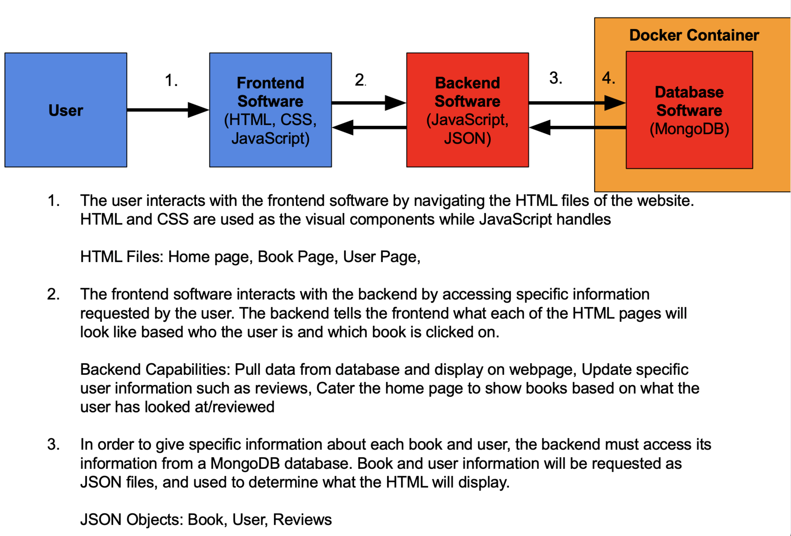

# Milestone 4
#### Sarthak, Albert, Tyler, Lucas, and Andy

- [Milestone 4](#milestone-4)
      - [Sarthak, Albert, Tyler, Lucas, and Andy](#sarthak-albert-tyler-lucas-and-andy)
  - [Revised List of Features](#revised-list-of-features)
  - [Architecture Diagram](#architecture-diagram)
  - [Front End Design](#front-end-design)
  - [Web Service Design](#web-service-design)
  - [Database Design](#database-design)
    - [Collections](#collections)
  - [Individual Contributions](#individual-contributions)
      - [Albert](#albert)
      - [Sarthak](#sarthak)
      - [Tyler](#tyler)
      - [Andy](#andy)
      - [Lucas](#lucas)
  - [Challenges](#challenges)

## Revised List of Features
Registration Page

New users will be able to create accounts with their emails, as well as be able to sign in to the website. When you are signed into the website you are directed to the user page with your information. Additionally, when you create an account you are also directed to your user page. Database The database is a way to store all the information that the website contains in a server so that users can easily access it when using the website. Information that needs to be stored includes: book data, user data, and all reviews.

Home/Explore Page

The home page will feature a search bar where the user can input any book they want, and will be directed to the books page for that book. Additionally, there will be a display of the top three genres currently available, as well as the top three books in those genres. Moreover, there is a general top 5 books display for the users as well.

Book Page

This page will pop up whenever a specific book is clicked on. It will include a cover of the book and any important information about it, as well as all reviews by different users and an average star rating at the top.

User Page

A page displaying a user’s profile information. This will include: books reviewed, books read, books on reading list, profiles that the user is following, and profiles that the user follows.

## Architecture Diagram

## Front End Design

- [Bookmark WireFrame](https://jamboard.google.com/d/1C0DM09n3203X0My2pCwiZzJxna1pNuFt0I3-7Bn78uQ/edit?usp=sharing)

## Web Service Design
- Our team is not using any web services
  

## Database Design 

Our group is using MongoDB as our database because we are only storing 3 different types of data - Users, Books, and Reviews - in our database, all of which are JSON objects, and their relationships with one another are very straightforward. Mongo was also the DB suggested by our TA, Karthik. 

Our parent database is called Bookmark, and it contains three collections: Users, Books, and Reviews. The attributes of each data-type define the columns of their respective collections. We will detail each data-type below.  

Users can rate and review books. Either action creates a review object (detailed below) which contains the ID of the user that wrote the review, the rating they gave the book (1-5), the ISBN of the book that review is related to, and of course the review itself. 

A users personal page will query the books collection for all books with ISBN numbers that match those in the users liked_books column. It will also query the reviews collection for all reviews which are associated with the user's ID. 

A book's page will query the reviews collection for all reviews associated with that book's ISBN. It will also average the ratings associated with all of these reviews and display them as the book's average rating, between 1-5.

### Collections 

- ### Users

  - Attributes / Columns
     -  last_name
     -  first_name
     -  email
     -  privileges (user, moderator, admin) 
     -  liked_books (books the user has 'liked', listed by ISBN)
     -  id (primary key for user collection)

  - As JSON: { "last_name":"Doe", "first_name":"John", "email":"john@doemail.com", "privileges":"user", "liked_books":"isbn_1, isbn_2, isbn_3... isbn_n:", "id":"#########"}
  

  
- ### Books
  - Attributes / Columns
    - author (first last)
    - cover (harry_potter_POA.jpg)
    - isbn (primary key for book collection)
    - pubdate (year book was published)
    - pub (publisher)
    - series
    - series_index (which book in series it is)
    - tags (genre)
    - title

  - As JSON: { "author":"authors", "cover":"cover", "isbn":"isbn", "pubdate":"pubdate", "pub":"publisher", "series":"series", "series_index":"series_index", "tags":"tags", "title":"title"}

- ### Reviews
  - Attributes / Columns 
    - date (date the review was created)
    - body (can be blank)
    - isbn (ISBN of the book being reviewed)
    - user_id (ID of the user who created the review)
    - id (primary key for review collection)

  - As JSON: { "date":"03/19/2021", "body":"This book sucks", "isbn":"#########", "user_id":"########", "id:"#########",}

## Individual Contributions

#### Albert 
    
Updated wireframe and started working on books page 1 html page. Also help try to fix issues that other members of the team were having.

[Albert's Commit](https://github.com/CSCI-3308-CU-Boulder/3308SP21_section013_5/commit/b9a5c4b2d71ebcd84e0abe7d3ead08020cf196b9)
    
#### Sarthak

Updated the previous wireframe design document to reflect the  changes made to registration/sign-in page, book-1 page, and books-2 page. Working on trying to get user DB set up with Andy so we can push the user objects as JSON objects into a database. 

[Sarthak's Commit](https://github.com/CSCI-3308-CU-Boulder/3308SP21_section013_5/commit/722dc1b2eacac5a1e52464a9d1341cb62e21e410)
    
#### Tyler

Worked on database setup and working on linking mongo with our server.

#### Andy
    
Finalized database architecture (detailed above), created and templated this document. I've also put significant time into troubleshooting some persistent team-wide issues that are yet unresolved.  I will detail those in the [Challenges](#challenges) section. 

[Andy's Commit](https://github.com/CSCI-3308-CU-Boulder/3308SP21_section013_5/commit/045dc5bf7f26cc0e82a7365a163718d38257d4b0#diff-2e59b9385bd7d85fb0ba0ab581e8da7cd7448b47ee897022467f9757ce486b11)

#### Lucas
 
Updated the architecture diagram and have been continuing to work on fixing our database issues to no avail. Next week I have a lot less on my schedule and will put significant time into making progress toward the project.

[Lucas's Commit](https://github.com/CSCI-3308-CU-Boulder/3308SP21_section013_5/commit/ae373f8230a6159ec738fe054b968e3e30146929)

## Challenges 

- Although most of our team has successfully set up a Docker container with the official Mongo image, only one person has been able to get Mongo to communicate with the Node server. We believe that this might have something to do with port forwarding, and have a couple lines of investigation to pursue there. We're also in communication with Karthik about this issue, and although it is currently creating a bottleneck, we don't believe it poses a real threat to our project. 
  
- We've not been able to get our front-end talking to our server. However, the last couple of labs have provided some insight about this, so we have some new leads on where to go next. We're in communication with Karthik about this as well. This is mission critical, and the database issues detailed above are making it difficult for us to combine our efforts at solving the problem. However, with some support, this is not likely to be a difficult problem to fix and we anticipate that it will be cleared up by the end of our TA check-in on Monday, 22 March. 
  
- We have data for ~450 books that we're going to use to populate the website. This includes .jpg images of the book covers - however, we haven't yet come up with a good solution for hosting these images online yet, especially in a way that preserves the filenames. It's possible that there is a cheap and easy solution for this and it's not going to be an issue - we're identifying it as a risk simply because it is as of yet an unknown. Worst case scenario is that we only end up with actual covers for a small subset of our books and the rest use a placeholder image.

